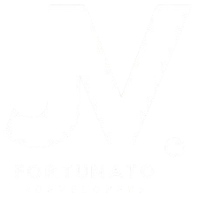

<div align="center">



# João Victor Fortunato

**Full Stack & Mobile Developer**


<br/>

[](https://www.linkedin.com/in/jvfortunato/)
[](mailto:jvfortunato.dev@gmail.com)

<br/>


</div>

---

## Sobre mim

```javascript
const joaoVictor = {
    role: "Analista de Sistemas",
    company: "Comercial Milano Brasil",
    location: "Brasil",
    
    expertise: ["React.js", "React Native", "TypeScript" , "Node.js", 
                "PHP", "Laravel", "Javascript" "SQL"]
};
```

---

## Tech Stack

<div align="center">

### Tecnologias


### Também trabalho com


</div>

---

## Estatísticas

<div align="center">

| Applications created | Projects and participations |
|:---:|:---:|
| **4+** | **15+** |
| Builds | Web & Mobile |

</div>

---

## Projetos em destaque

### Projetos Web

> Todos os sistemas foram cirados com **PHP** + **Bootstrap**

| Project | Stack | Link |
|:--------|:------|:----:|
| **Vem Marcar!** - Gerenciador de agendas para prestadores de serviços | PHP, Bootstrap | [Demo](https://vemmarcar.com.br/) |
| **Pousada Parnaioca** - Sistema para gerenciamento de hotelaria | PHP, Bootstrap |  |

<br/>

---

## GitHub Analytics


<br/><br/>


</div>

---

**"Transformando ideias em código e código em soluções."**

<br/>


